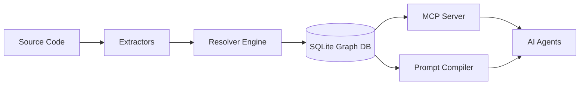

# 🧠 CGIS: Code Graph Intelligence System
<!-- mcp-name: io.github.zaebee/codegraph-brain -->
### *A code graph your AI agent can query instead of guess*

[](https://github.com/zaebee/codegraph-brain/actions/workflows/ci.yml)
[](https://github.com/zaebee/codegraph-brain/actions/workflows/autodoc.yml)
[](https://pypi.org/project/codegraph-brain/)

**Ask "what breaks if I change this?" and get the call chain, not a guess.**

CGIS parses a repository with tree-sitter into a graph of fully qualified symbols and the calls, imports and containment between them, stores it in SQLite, and serves it to AI agents over MCP. An agent that would otherwise grep and read whole files asks the graph instead.

- **Languages:** Python · TypeScript / TSX
- **Runs:** locally — no account, no telemetry; the graph never leaves your disk ([the one opt-in exception](https://github.com/zaebee/codegraph-brain/blob/main/PRIVACY.md))

```console
$ cgis ingest src --output graph.db
$ cgis impact cgis.query.engine.QueryEngine.get_flow_graph --db graph.db --depth 2
🔍 Analyzing transitive upstream callers of: cgis.query.engine.QueryEngine.get_flow_graph

METHOD cgis.query.engine.QueryEngine.get_flow_graph (cgis/query/engine.py:215)
├── FUNCTION cgis.query.context.context_service._collect_callees (cgis/query/context/context_service.py:44)
│   └── FUNCTION cgis.query.context.context_service.build_context (cgis/query/context/context_service.py:96)
└── METHOD cgis.guardian.collector.ContextCollector._graph_sections (cgis/guardian/collector.py:174)
    ├── METHOD cgis.guardian.collector.ContextCollector.collect_graph_context (cgis/guardian/collector.py:213)
    └── METHOD cgis.guardian.collector.ContextCollector.collect_for_chunk (cgis/guardian/collector.py:303)
```

*Real output — CGIS run on its own source.*

---

## 🚀 Quickstart

### In Claude Code (fastest)

```bash
/plugin marketplace add zaebee/codegraph-brain
/plugin install cgis@codegraph-brain
```

That ships the MCP server, a skill that teaches the agent *when* to query the graph instead of reading files, and `/cgis:ingest` to build the graph on first use. The server is pulled from PyPI on demand via `uvx`, so there is nothing to clone or build.

### Any other MCP client (Cursor, Claude Desktop, …)

```json
{
  "mcpServers": {
    "cgis": { "command": "uvx", "args": ["--from", "codegraph-brain", "cgis-mcp"] }
  }
}
```

### From the terminal

```bash
# No install needed — uvx fetches it from PyPI
uvx --from codegraph-brain cgis ingest ./my-project --output graph.db

uvx --from codegraph-brain cgis impact "my_module.core_function" --db graph.db --depth 5   # who calls this
uvx --from codegraph-brain cgis trace  "my_module.MyClass.run"   --db graph.db --depth 3   # what this calls
# add --format mermaid (or json) to either for a diagram or machine-readable output
```

Or install it for good: `pip install codegraph-brain` (Python 3.12+), then use `cgis` directly. The full command list is in [CLI_USAGE.md](https://github.com/zaebee/codegraph-brain/blob/main/docs/how-to/CLI_USAGE.md).

---

## 📈 Proof at Real Scale

CGIS runs on a working twelve-repository estate — four languages, 8,146 commits, shipping daily. On its 512-file FastAPI backend it classifies **88.4% of 40,493 edges** definitively, and prints the remaining 11.6% instead of inventing targets for them.

**[Read the case study →](https://github.com/zaebee/codegraph-brain/blob/main/docs/CASE_STUDY.md)** — every figure measured and reproducible, including what CGIS *doesn't* cover.

---

## 🤔 Why a graph, and how this differs

Text retrieval hands an agent chunks that *look* related. It cannot say which of three functions named `save` a call reaches, or what sits five callers up. CGIS resolves every call site to a fully qualified name when the source allows it — and when it does not, the edge stays marked unresolved and is counted, never filled with a plausible guess.

| If you use… | CGIS adds |
| :--- | :--- |
| grep / file reads in the agent | Transitive callers and callees in one call, without spending context on whole files |
| LSP-backed symbol tools (e.g. Serena) | A persisted whole-repo graph for multi-hop impact, coupling, PageRank and drift |
| A repo map (e.g. aider) | Resolved edges you can traverse and audit, with the resolved/unresolved ratio reported |

---

## 🤖 MCP Tools

The main tools:

| Tool | Answers |
| :--- | :--- |
| `cgis_ingest` | Build or incrementally refresh the graph |
| `cgis_overview` | Where to start: sizes and the largest packages, when you have no FQN yet |
| `cgis_find_symbol` | Partial name → candidate FQNs |
| `cgis_analyze_impact` | What breaks upstream if this changes? |
| `cgis_trace_flow` | What does this call, transitively? |
| `cgis_get_structure` | Class / module hierarchy |
| `cgis_context` | A compact GraphRAG context package for one symbol |
| `cgis_metrics` | Coupling, god classes, PageRank, package cohesion |
| `cgis_audit_reachability` | Authz / IDOR coverage — does every handler reach its guard? |
| `cgis_drift` | How far each domain has moved from its declared pattern |
| `cgis_validate` | Graph integrity: resolved vs unresolved edges |

All 14 tools, with parameters: [MCP_REFERENCE.md](https://github.com/zaebee/codegraph-brain/blob/main/docs/how-to/MCP_REFERENCE.md).

---

## 🏗️ How It Works

1.  **Extract** — tree-sitter parsers turn each file into nodes and raw call edges.
2.  **Resolve** — the `ResolverEngine` maps raw calls to fully qualified names, or leaves them explicitly unresolved.
3.  **Store** — SQLite holds the graph; queries are breadth-first traversals over it.



The details — and a pipeline graph CGIS regenerates from its own source on every change — are in [HOW_IT_WORKS.md](https://github.com/zaebee/codegraph-brain/blob/main/docs/architecture/HOW_IT_WORKS.md).

---

## 🛡️ Guardian: Graph-Aware Code Review

**Guardian** is CGIS's built-in LLM reviewer — it reviews pull requests using the *graph* as context, not just the diff text. It runs in CI and posts inline comments anchored to the exact line.

*   **Two-stage, recall-first:** a **finder** surfaces every plausible defect (optimised for recall), then a separate **skeptic** pass filters false positives — closer to how human reviewers work, and far more reliable than a single precision-gated prompt.
*   **Local *or* cloud, no lock-in:** point it at **Ollama** (`qwen2.5-coder`, `llama3.1`, `granite-code`, …) for free local inference, or at **Mistral / Gemini** in the cloud. You can even mix them — a strong cloud finder with a free local *cross-model* skeptic.
*   **Graph-aware context:** the reviewer sees impact graphs, architectural drift, and project ontology — so it catches structural and convention defects a flat-diff reviewer can't.
*   **Deterministic anchoring:** every inline comment is positioned by a verbatim quote from the diff, not the model's (often wrong) line guess.
*   **Dogfooded & measured:** Guardian reviews CGIS's *own* pull requests, and a benchmark harness scores it against curated ground truth — so prompt changes are validated, not guessed.

```bash
# Build the graph, then review a PR with a local model (no API key)
cgis ingest ./src --output graph.db
GUARDIAN_PROVIDER=ollama GUARDIAN_MODEL=qwen2.5-coder:14b \
  uv run python scripts/guardian_review.py --pr 123 --db graph.db --inline
```

No GPU on hand? **[Benchmark it on a notebook GPU →](https://github.com/zaebee/codegraph-brain/blob/main/docs/GUARDIAN_LOCAL_BENCH.md)** — free end to end, since the fixtures score without an LLM judge. Or **[point Guardian at a remote Ollama →](https://github.com/zaebee/codegraph-brain/blob/main/docs/GUARDIAN_REMOTE_OLLAMA.md)** — over an frp stcp tunnel, no public port, and a guard that refuses a review of a silently truncated prompt.

---

## 🔒 Privacy

CGIS collects nothing: no telemetry, no analytics, no account. Your code and the graph built from it stay on your machine. The one exception is opt-in: Guardian, if you run it with a cloud model, sends the reviewed diff to the provider you chose. See [PRIVACY.md](https://github.com/zaebee/codegraph-brain/blob/main/PRIVACY.md).

---

## 🛠️ Development

Requires Python 3.12+ and [`uv`](https://docs.astral.sh/uv/).

```bash
git clone https://github.com/zaebee/codegraph-brain && cd codegraph-brain
uv sync
make pytest
```

See [CONTRIBUTING.md](https://github.com/zaebee/codegraph-brain/blob/main/CONTRIBUTING.md) for the standards: strict MyPy, linting, ontology compliance.

---

## 💼 Architecture Audit

CGIS is free and you can run it yourself. If you would rather have the analysis than the tool, I run a fixed-price audit of your codebase's structure — authorisation coverage, blast radius, coupling, architectural drift — delivered in five working days, $2,400 fixed, with an explicit list of what the analysis cannot see. **[Read what's included →](https://github.com/zaebee/codegraph-brain/blob/main/docs/AUDIT.md)**
