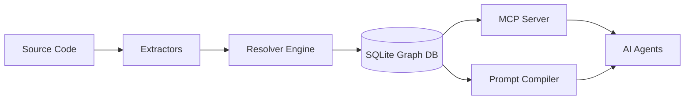

# 🧠 CGIS: Code Graph Intelligence System
### *The Semantic Ground Truth for AI Agents*

[](https://github.com/zaebee/codegraph-brain/actions/workflows/ci.yml)
[](https://github.com/zaebee/codegraph-brain/actions/workflows/autodoc.yml)

**LLM coding agents (Claude, Cursor, GPT) are currently "guessing" your architecture based on flat text snippets. CGIS stops the guessing.**

CGIS transforms raw source code into a deterministic, multi-layered semantic graph. It provides AI agents with a high-fidelity architectural model, enabling them to understand not just what the code *says*, but how it *behaves* and *connects*.

---

## ⚡ The Problem: The "Context Gap"
Traditional RAG (Retrieval-Augmented Generation) feeds agents chunks of text. This leads to:
*   **Hallucinations:** Agents assume connections that don't exist.
*   **Context Bloat:** Passing entire files to explain a single function.
*   **Structural Blindness:** Agents cannot "see" transitive impacts (e.g., *"If I change this, what breaks 5 layers up?"*).

## ✨ The Solution: Semantic Intelligence
CGIS replaces "textual guessing" with **"structural calculation"**:
*   **Deterministic Resolution:** Full FQN (Fully Qualified Name) resolution via AST-based extraction.
*   **Multi-Layer Ontology:** Goes beyond calls. It understands `CONTAINS`, `DECLARES`, `IMPORTS`, and semantic domains.
*   **Agent-Native (MCP):** Exposes the entire graph as a set of high-performance tools for Claude, Cursor, and custom agents.
*   **Architectural Drift Gates:** Measures how far a change pushes each domain from its *declared* ideal pattern (a motif-basis fingerprint) — a soft, quantitative CI gate for architectural hygiene.
*   **Graph-Aware Code Review:** A built-in LLM reviewer (**Guardian**) that reads the graph as context and reviews pull requests — runs on **local (Ollama) or cloud** models, no vendor lock-in.
*   **Self-Documenting:** The documentation is a living artifact, automatically updated with live architecture diagrams.

---

## 🏗️ Architecture: The Pipeline

CGIS operates via a high-speed, three-stage pipeline:

1.  **EXTRACT:** Language-specific AST parsers (Tree-sitter) convert source code into raw nodes and edges.
2.  **RESOLVE:** The `ResolverEngine` disambiguates raw calls into absolute, deterministic FQNs.
3.  **STORE:** A high-performance SQLite backend enables complex graph traversals (BFS/DFS) in milliseconds.



---

## 🚀 Quickstart

### 1. Installation
Using `uv` (recommended):
```bash
uv pip install -e .
```

### 2. Ingest a Repository
Turn any codebase into a semantic knowledge graph:
```bash
cgis ingest ./my-awesome-project --output graph.db
```

### 3. Query the Graph
Analyze impact or trace execution flow directly from your terminal:
```bash
# Trace the execution path of a function
cgis trace "my_module.MyClass.my_method" --depth 3 --format mermaid

# Analyze the blast radius of a change
cgis impact "my_module.core_function" --depth 5
```

---

## 🔌 Install as a Claude Code plugin

The fastest path — no config files, no paths to wire up:

```bash
/plugin marketplace add zaebee/codegraph-brain
/plugin install cgis@codegraph-brain
```

That ships the MCP server, a skill that teaches the agent *when* to query the graph instead of reading files, and `/cgis:ingest` to build the graph on first use. The server is pulled from PyPI on demand via `uvx`, so there is nothing to clone or build.

---

## 🤖 Agent Integration (MCP)

CGIS is designed to be plugged into your AI workflow via the **Model Context Protocol (MCP)**. Once running, your agent gains "Superpowers":

*   `cgis_ingest`: Build the knowledge base.
*   `cgis_trace_flow`: Visualize execution paths.
*   `cgis_analyze_impact`: Predict regressions before they happen.
*   `cgis_get_structure`: Understand class/module hierarchy.
*   `cgis_context`: Compile a GraphRAG context package for a symbol.
*   `cgis_drift`: Measure architectural drift vs each domain's ideal pattern.
*   `cgis_metrics`: Coupling, god-classes, PageRank, package cohesion.
*   `cgis_audit_reachability`: Authz/IDOR coverage — does every handler reach its guard?

---

## 🛡️ Guardian: Graph-Aware Code Review

**Guardian** is CGIS's built-in LLM reviewer — it reviews pull requests using the *graph* as context, not just the diff text. It runs in CI and posts inline comments anchored to the exact line.

*   **Two-stage, recall-first:** a **finder** surfaces every plausible defect (optimised for recall), then a separate **skeptic** pass filters false positives — closer to how human reviewers work, and far more reliable than a single precision-gated prompt.
*   **Local *or* cloud, no lock-in:** point it at **Ollama** (`qwen2.5-coder`, `llama3.1`, `granite-code`, …) for free local inference, or at **Mistral / Gemini** in the cloud. You can even mix them — a strong cloud finder with a free local *cross-model* skeptic.
*   **Graph-aware context:** the reviewer sees impact graphs, architectural drift, and project ontology — so it catches structural and convention defects a flat-diff reviewer can't.
*   **Deterministic anchoring:** every inline comment is positioned by a verbatim quote from the diff, not the model's (often wrong) line guess.
*   **Dogfooded & measured:** Guardian reviews CGIS's *own* pull requests, and a benchmark harness scores it against curated ground truth — so prompt changes are validated, not guessed.

```bash
# Build the graph, then review a PR with a local model (no API key)
cgis ingest ./src --output graph.db
GUARDIAN_PROVIDER=ollama GUARDIAN_MODEL=qwen2.5-coder:14b \
  uv run python scripts/guardian_review.py --pr 123 --db graph.db --inline
```

---

## 📈 Proof at Real Scale

CGIS runs on a working twelve-repository estate — four languages, 8,146 commits, shipping daily. On its 512-file FastAPI backend it classifies **88.4% of 40,493 edges** definitively, and prints the remaining 11.6% instead of inventing targets for them.

**[Read the case study →](docs/CASE_STUDY.md)** — every figure measured and reproducible, including what CGIS *doesn't* cover.

---

## 📊 Live System Architecture
*Kept in sync with the codebase — update this diagram when the core pipeline changes.*

<!-- START_CGIS_GRAPH -->
> *Auto-generated by CGIS parsing its own source — the tool documents itself.*

```mermaid
graph TD
classDef classNode fill:#e8f5e9,stroke:#2e7d32,stroke-width:1.5px,color:#1b5e20;
classDef funcNode fill:#e3f2fd,stroke:#1565c0,stroke-width:1.5px,color:#0d47a1;
classDef methodNode fill:#f3e5f5,stroke:#7b1fa2,stroke-width:1.5px,color:#4a148c;
classDef unresolvedNode fill:#fffde7,stroke:#fbc02d,stroke-width:1.5px,stroke-dasharray: 4 4,color:#f57f17;
classDef defaultNode fill:#fafafa,stroke:#9e9e9e,stroke-width:1.5px,color:#212121;
classDef stdlibNode fill:#eceff1,stroke:#607d8b,stroke-width:1px,color:#455a64;
classDef externalNode fill:#fff3e0,stroke:#e65100,stroke-width:1px,stroke-dasharray: 3 3,color:#bf360c;

    subgraph sg_pipeline["pipeline.py"]
        pipeline_IngestionPipeline_get_extractor["_get_extractor (pipeline.py:245)"]:::methodNode
        pipeline_IngestionPipeline_is_noop_incremental["_is_noop_incremental (pipeline.py:185)"]:::methodNode
        pipeline_IngestionPipeline_persist_incremental["_persist_incremental (pipeline.py:204)"]:::methodNode
        pipeline_IngestionPipeline_process_file["_process_file (pipeline.py:155)"]:::methodNode
        pipeline_IngestionPipeline_run["run (pipeline.py:51)"]:::methodNode
    end
    subgraph sg_engine["engine.py"]
        engine_ResolverEngine["ResolverEngine (engine.py:18)"]:::classNode
        engine_ResolverEngine_resolve["resolve (engine.py:35)"]:::methodNode
    end
    subgraph sg_uplift["uplift.py"]
        uplift_SemanticUpliftEngine["SemanticUpliftEngine (uplift.py:66)"]:::classNode
        uplift_SemanticUpliftEngine_execute_uplift["execute_uplift (uplift.py:91)"]:::methodNode
    end
    pipeline_IngestionPipeline_run -->|CALLS| pipeline_IngestionPipeline_get_extractor
    pipeline_IngestionPipeline_run -->|CALLS| pipeline_IngestionPipeline_process_file
    pipeline_IngestionPipeline_run -->|CALLS| pipeline_IngestionPipeline_is_noop_incremental
    pipeline_IngestionPipeline_run -->|CALLS| engine_ResolverEngine
    pipeline_IngestionPipeline_run -->|CALLS| engine_ResolverEngine_resolve
    pipeline_IngestionPipeline_run -->|CALLS| pipeline_IngestionPipeline_persist_incremental
    pipeline_IngestionPipeline_run -->|CALLS| uplift_SemanticUpliftEngine_execute_uplift
    pipeline_IngestionPipeline_run -->|CALLS| uplift_SemanticUpliftEngine
```



| Symbol | Type | File |
|--------|------|------|
| `run` | METHOD | [`pipeline.py:51`](https://github.com/zaebee/codegraph-brain/blob/main/src/cgis/pipeline.py#L51) |
| `_process_file` | METHOD | [`pipeline.py:155`](https://github.com/zaebee/codegraph-brain/blob/main/src/cgis/pipeline.py#L155) |
| `_is_noop_incremental` | METHOD | [`pipeline.py:185`](https://github.com/zaebee/codegraph-brain/blob/main/src/cgis/pipeline.py#L185) |
| `_persist_incremental` | METHOD | [`pipeline.py:204`](https://github.com/zaebee/codegraph-brain/blob/main/src/cgis/pipeline.py#L204) |
| `_get_extractor` | METHOD | [`pipeline.py:245`](https://github.com/zaebee/codegraph-brain/blob/main/src/cgis/pipeline.py#L245) |
| `ResolverEngine` | CLASS | [`engine.py:18`](https://github.com/zaebee/codegraph-brain/blob/main/src/cgis/resolver/engine.py#L18) |
| `resolve` | METHOD | [`engine.py:35`](https://github.com/zaebee/codegraph-brain/blob/main/src/cgis/resolver/engine.py#L35) |
| `SemanticUpliftEngine` | CLASS | [`uplift.py:66`](https://github.com/zaebee/codegraph-brain/blob/main/src/cgis/resolver/uplift.py#L66) |
| `execute_uplift` | METHOD | [`uplift.py:91`](https://github.com/zaebee/codegraph-brain/blob/main/src/cgis/resolver/uplift.py#L91) |
<!-- END_CGIS_GRAPH -->

---

## 💼 Architecture Audit

CGIS is free and you can run it yourself. If you would rather have the analysis than the tool, I run a fixed-price audit of your codebase's structure — authorisation coverage, blast radius, coupling, architectural drift — delivered in five working days.

**[Read what's included →](docs/AUDIT.md)** — $2,400 fixed, with an explicit list of what the analysis cannot see.

---

## 🔒 Privacy

CGIS collects nothing: no telemetry, no analytics, no account. Your code and the graph built from it stay on your machine. See [PRIVACY.md](PRIVACY.md).

---

## 🛠️ Development

### Requirements
*   Python 3.12+
*   `uv` (for dependency management)

### Running Tests
```bash
make pytest
```

### Contributing
We are building the future of agentic engineering. Please see `CONTRIBUTING.md` for our standards on type safety (strict MyPy), linting, and ontology compliance.

---
*Built with ❤️ for the future of autonomous software engineering.*
