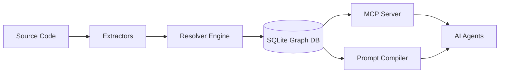

# 🧠 CGIS: Code Graph Intelligence System
### *The Semantic Ground Truth for AI Agents*

[](https://github.com/zaebee/codegraph-brain/actions/workflows/ci.yml)
[](https://github.com/zaebee/codegraph-brain/actions/workflows/autodoc.yml)

**LLM coding agents (Claude, Cursor, GPT) are currently "guessing" your architecture based on flat text snippets. CGIS stops the guessing.**

CGIS transforms raw source code into a deterministic, multi-layered semantic graph. It provides AI agents with a high-fidelity architectural model, enabling them to understand not just what the code *says*, but how it *behaves* and *connects*.

---

## ⚡ The Problem: The "Context Gap"
Traditional RAG (Retrieval-Augmented Generation) feeds agents chunks of text. This leads to:
*   **Hallucinations:** Agents assume connections that don't exist.
*   **Context Bloat:** Passing entire files to explain a single function.
*   **Structural Blindness:** Agents cannot "see" transitive impacts (e.g., *"If I change this, what breaks 5 layers up?"*).

## ✨ The Solution: Semantic Intelligence
CGIS replaces "textual guessing" with **"structural calculation"**:
*   **Deterministic Resolution:** Full FQN (Fully Qualified Name) resolution via AST-based extraction.
*   **Multi-Layer Ontology:** Goes beyond calls. It understands `CONTAINS`, `DECLARES`, `IMPORTS`, and semantic domains.
*   **Agent-Native (MCP):** Exposes the entire graph as a set of high-performance tools for Claude, Cursor, and custom agents.
*   **Self-Documenting:** The documentation is a living artifact, automatically updated with live architecture diagrams.

---

## 🏗️ Architecture: The Pipeline

CGIS operates via a high-speed, three-stage pipeline:

1.  **EXTRACT:** Language-specific AST parsers (Tree-sitter) convert source code into raw nodes and edges.
2.  **RESOLVE:** The `ResolverEngine` disambiguates raw calls into absolute, deterministic FQNs.
3.  **STORE:** A high-performance SQLite backend enables complex graph traversals (BFS/DFS) in milliseconds.



---

## 🚀 Quickstart

### 1. Installation
Using `uv` (recommended):
```bash
uv pip install -e .
```

### 2. Ingest a Repository
Turn any codebase into a semantic knowledge graph:
```bash
cgis ingest ./my-awesome-project --output graph.db
```

### 3. Query the Graph
Analyze impact or trace execution flow directly from your terminal:
```bash
# Trace the execution path of a function
cgis trace "my_module.MyClass.my_method" --depth 3 --format mermaid

# Analyze the blast radius of a change
cgis impact "my_module.core_function" --depth 5
```

---

## 🤖 Agent Integration (MCP)

CGIS is designed to be plugged into your AI workflow via the **Model Context Protocol (MCP)**. Once running, your agent gains "Superpowers":

*   `cgis_ingest`: Build the knowledge base.
*   `cgis_trace_flow`: Visualize execution paths.
*   `cgis_analyze_impact`: Predict regressions before they happen.
*   `cgis_get_structure`: Understand class/module hierarchy.

---

## 📊 Live System Architecture
*Kept in sync with the codebase — update this diagram when the core pipeline changes.*

<!-- START_CGIS_GRAPH -->
> *Auto-generated by CGIS parsing its own source — the tool documents itself.*

```mermaid
graph TD
classDef classNode fill:#e8f5e9,stroke:#2e7d32,stroke-width:1.5px,color:#1b5e20;
classDef funcNode fill:#e3f2fd,stroke:#1565c0,stroke-width:1.5px,color:#0d47a1;
classDef methodNode fill:#f3e5f5,stroke:#7b1fa2,stroke-width:1.5px,color:#4a148c;
classDef unresolvedNode fill:#fffde7,stroke:#fbc02d,stroke-width:1.5px,stroke-dasharray: 4 4,color:#f57f17;
classDef defaultNode fill:#fafafa,stroke:#9e9e9e,stroke-width:1.5px,color:#212121;
classDef stdlibNode fill:#eceff1,stroke:#607d8b,stroke-width:1px,color:#455a64;
classDef externalNode fill:#fff3e0,stroke:#e65100,stroke-width:1px,stroke-dasharray: 3 3,color:#bf360c;

    n_06f165ce6159025b3d337c5bfd5db011["parse (base.py:17)"]:::methodNode
    n_ff404e1acb926348cf6695cd4b3cd0e5["_compute_hash (pipeline.py:43)"]:::methodNode
    n_0f875e605375c329869f67b3fb05ca43["_get_extractor (pipeline.py:210)"]:::methodNode
    n_705d8fa6977288feb6d561fe353917bd["_persist_incremental (pipeline.py:171)"]:::methodNode
    n_69ab802205de25759be41c9155266b2c["_process_file (pipeline.py:141)"]:::methodNode
    n_380356b2071cde8dd55ba6287e99bd8a["run (pipeline.py:47)"]:::methodNode
    n_ebda4de8e05ef057deb454e72894302d["ResolverEngine (engine.py:14)"]:::classNode
    n_620c62f30c329079d404e5ee19273ec2["_ensure_virtual_node (engine.py:196)"]:::methodNode
    n_68137e311129753bfcf0177e775ab92d["_resolve_class_ref (engine.py:79)"]:::methodNode
    n_5c2627033cdedc57c1d8169e75386781["_resolve_global_call (engine.py:289)"]:::methodNode
    n_78c9c20797a342e69dfe3ca20a232185["_resolve_self_call (engine.py:201)"]:::methodNode
    n_e75ca2e29418d9c85a1a14b7069c25d9["resolve (engine.py:149)"]:::methodNode
    n_2dda32fbe79232f92feae85b97527aff["SemanticUpliftEngine (uplift.py:66)"]:::classNode
    n_aafcdc9602017019ffdfedea66173d0e["execute_uplift (uplift.py:91)"]:::methodNode
    n_fccaae17a7efb9db3c3284c37cd01054["_phase1_map_ontology_classes (uplift.py:130)"]:::funcNode
    n_8dfb1bd527a41875665289d05015eba6["_phase2_apply_heuristic_tagging (uplift.py:147)"]:::funcNode
    n_8a67701509666ff4987fbad06d89934f["_phase3_propagate_domains (uplift.py:181)"]:::funcNode
    n_9beea931a114ce9653ea3bdf46f34b5d["_phase4_infer_domain_dependencies (uplift.py:220)"]:::funcNode
    n_3ad99d1c366a80239aefbf9252b220ac["get_all_tracked_files (sqlite_store.py:459)"]:::methodNode
    n_3f3701b3408a0a099c863445134da334["get_file_hash (sqlite_store.py:291)"]:::methodNode
    n_88d2e42cee7ab2944ff1f2ea6b695c38["get_nodes_by_file (sqlite_store.py:355)"]:::methodNode
    n_ca50b8c2d14b8a6eaf85ee6288ac7248["save_incremental_batch (sqlite_store.py:325)"]:::methodNode
    n_50f54e04e64a94ab9730c1cd66cd8b98["upsert_nodes (sqlite_store.py:172)"]:::methodNode
    n_380356b2071cde8dd55ba6287e99bd8a -->|CALLS| n_0f875e605375c329869f67b3fb05ca43
    n_380356b2071cde8dd55ba6287e99bd8a -->|CALLS| n_69ab802205de25759be41c9155266b2c
    n_380356b2071cde8dd55ba6287e99bd8a -->|CALLS| n_ebda4de8e05ef057deb454e72894302d
    n_380356b2071cde8dd55ba6287e99bd8a -->|CALLS| n_e75ca2e29418d9c85a1a14b7069c25d9
    n_380356b2071cde8dd55ba6287e99bd8a -->|CALLS| n_705d8fa6977288feb6d561fe353917bd
    n_380356b2071cde8dd55ba6287e99bd8a -->|CALLS| n_aafcdc9602017019ffdfedea66173d0e
    n_380356b2071cde8dd55ba6287e99bd8a -->|CALLS| n_2dda32fbe79232f92feae85b97527aff
    n_705d8fa6977288feb6d561fe353917bd -->|CALLS| n_3ad99d1c366a80239aefbf9252b220ac
    n_705d8fa6977288feb6d561fe353917bd -->|CALLS| n_ca50b8c2d14b8a6eaf85ee6288ac7248
    n_705d8fa6977288feb6d561fe353917bd -->|CALLS| n_50f54e04e64a94ab9730c1cd66cd8b98
    n_69ab802205de25759be41c9155266b2c -->|CALLS| n_ff404e1acb926348cf6695cd4b3cd0e5
    n_69ab802205de25759be41c9155266b2c -->|CALLS| n_3f3701b3408a0a099c863445134da334
    n_69ab802205de25759be41c9155266b2c -->|CALLS| n_88d2e42cee7ab2944ff1f2ea6b695c38
    n_69ab802205de25759be41c9155266b2c -->|CALLS| n_06f165ce6159025b3d337c5bfd5db011
    n_e75ca2e29418d9c85a1a14b7069c25d9 -->|CALLS| n_68137e311129753bfcf0177e775ab92d
    n_e75ca2e29418d9c85a1a14b7069c25d9 -->|CALLS| n_620c62f30c329079d404e5ee19273ec2
    n_e75ca2e29418d9c85a1a14b7069c25d9 -->|CALLS| n_620c62f30c329079d404e5ee19273ec2
    n_e75ca2e29418d9c85a1a14b7069c25d9 -->|CALLS| n_78c9c20797a342e69dfe3ca20a232185
    n_e75ca2e29418d9c85a1a14b7069c25d9 -->|CALLS| n_5c2627033cdedc57c1d8169e75386781
    n_e75ca2e29418d9c85a1a14b7069c25d9 -->|CALLS| n_620c62f30c329079d404e5ee19273ec2
    n_aafcdc9602017019ffdfedea66173d0e -->|CALLS| n_fccaae17a7efb9db3c3284c37cd01054
    n_aafcdc9602017019ffdfedea66173d0e -->|CALLS| n_8dfb1bd527a41875665289d05015eba6
    n_aafcdc9602017019ffdfedea66173d0e -->|CALLS| n_8a67701509666ff4987fbad06d89934f
    n_aafcdc9602017019ffdfedea66173d0e -->|CALLS| n_9beea931a114ce9653ea3bdf46f34b5d
```



| Symbol | Type | File |
|--------|------|------|
| `extend` | FUNCTION | [`EXTERNAL:0`](https://github.com/zaebee/codegraph-brain/blob/main/src/EXTERNAL#L0) |
| `add` | FUNCTION | [`EXTERNAL:0`](https://github.com/zaebee/codegraph-brain/blob/main/src/EXTERNAL#L0) |
| `endswith` | FUNCTION | [`EXTERNAL:0`](https://github.com/zaebee/codegraph-brain/blob/main/src/EXTERNAL#L0) |
| `items` | FUNCTION | [`EXTERNAL:0`](https://github.com/zaebee/codegraph-brain/blob/main/src/EXTERNAL#L0) |
| `items` | FUNCTION | [`EXTERNAL:0`](https://github.com/zaebee/codegraph-brain/blob/main/src/EXTERNAL#L0) |
| `delete_semantic_uplift` | FUNCTION | [`EXTERNAL:0`](https://github.com/zaebee/codegraph-brain/blob/main/src/EXTERNAL#L0) |
| `get_all_edges` | FUNCTION | [`EXTERNAL:0`](https://github.com/zaebee/codegraph-brain/blob/main/src/EXTERNAL#L0) |
| `get_all_nodes` | FUNCTION | [`EXTERNAL:0`](https://github.com/zaebee/codegraph-brain/blob/main/src/EXTERNAL#L0) |
| `upsert_edges` | FUNCTION | [`EXTERNAL:0`](https://github.com/zaebee/codegraph-brain/blob/main/src/EXTERNAL#L0) |
| `upsert_nodes` | FUNCTION | [`EXTERNAL:0`](https://github.com/zaebee/codegraph-brain/blob/main/src/EXTERNAL#L0) |
| `parse` | METHOD | [`base.py:17`](https://github.com/zaebee/codegraph-brain/blob/main/src/cgis/extractors/base.py#L17) |
| `_compute_hash` | METHOD | [`pipeline.py:43`](https://github.com/zaebee/codegraph-brain/blob/main/src/cgis/pipeline.py#L43) |
| `run` | METHOD | [`pipeline.py:47`](https://github.com/zaebee/codegraph-brain/blob/main/src/cgis/pipeline.py#L47) |
| `_process_file` | METHOD | [`pipeline.py:141`](https://github.com/zaebee/codegraph-brain/blob/main/src/cgis/pipeline.py#L141) |
| `_persist_incremental` | METHOD | [`pipeline.py:171`](https://github.com/zaebee/codegraph-brain/blob/main/src/cgis/pipeline.py#L171) |
| `_get_extractor` | METHOD | [`pipeline.py:210`](https://github.com/zaebee/codegraph-brain/blob/main/src/cgis/pipeline.py#L210) |
| `ResolverEngine` | CLASS | [`engine.py:14`](https://github.com/zaebee/codegraph-brain/blob/main/src/cgis/resolver/engine.py#L14) |
| `_resolve_class_ref` | METHOD | [`engine.py:79`](https://github.com/zaebee/codegraph-brain/blob/main/src/cgis/resolver/engine.py#L79) |
| `resolve` | METHOD | [`engine.py:149`](https://github.com/zaebee/codegraph-brain/blob/main/src/cgis/resolver/engine.py#L149) |
| `_ensure_virtual_node` | METHOD | [`engine.py:196`](https://github.com/zaebee/codegraph-brain/blob/main/src/cgis/resolver/engine.py#L196) |
| `_resolve_self_call` | METHOD | [`engine.py:201`](https://github.com/zaebee/codegraph-brain/blob/main/src/cgis/resolver/engine.py#L201) |
| `_resolve_global_call` | METHOD | [`engine.py:289`](https://github.com/zaebee/codegraph-brain/blob/main/src/cgis/resolver/engine.py#L289) |
| `SemanticUpliftEngine` | CLASS | [`uplift.py:66`](https://github.com/zaebee/codegraph-brain/blob/main/src/cgis/resolver/uplift.py#L66) |
| `execute_uplift` | METHOD | [`uplift.py:91`](https://github.com/zaebee/codegraph-brain/blob/main/src/cgis/resolver/uplift.py#L91) |
| `_phase1_map_ontology_classes` | FUNCTION | [`uplift.py:130`](https://github.com/zaebee/codegraph-brain/blob/main/src/cgis/resolver/uplift.py#L130) |
| `_phase2_apply_heuristic_tagging` | FUNCTION | [`uplift.py:147`](https://github.com/zaebee/codegraph-brain/blob/main/src/cgis/resolver/uplift.py#L147) |
| `_phase3_propagate_domains` | FUNCTION | [`uplift.py:181`](https://github.com/zaebee/codegraph-brain/blob/main/src/cgis/resolver/uplift.py#L181) |
| `_phase4_infer_domain_dependencies` | FUNCTION | [`uplift.py:220`](https://github.com/zaebee/codegraph-brain/blob/main/src/cgis/resolver/uplift.py#L220) |
| `upsert_nodes` | METHOD | [`sqlite_store.py:172`](https://github.com/zaebee/codegraph-brain/blob/main/src/cgis/storage/sqlite_store.py#L172) |
| `get_file_hash` | METHOD | [`sqlite_store.py:291`](https://github.com/zaebee/codegraph-brain/blob/main/src/cgis/storage/sqlite_store.py#L291) |
| `save_incremental_batch` | METHOD | [`sqlite_store.py:325`](https://github.com/zaebee/codegraph-brain/blob/main/src/cgis/storage/sqlite_store.py#L325) |
| `get_nodes_by_file` | METHOD | [`sqlite_store.py:355`](https://github.com/zaebee/codegraph-brain/blob/main/src/cgis/storage/sqlite_store.py#L355) |
| `get_all_tracked_files` | METHOD | [`sqlite_store.py:459`](https://github.com/zaebee/codegraph-brain/blob/main/src/cgis/storage/sqlite_store.py#L459) |
<!-- END_CGIS_GRAPH -->

---

## 🛠️ Development

### Requirements
*   Python 3.12+
*   `uv` (for dependency management)

### Running Tests
```bash
make pytest
```

### Contributing
We are building the future of agentic engineering. Please see `CONTRIBUTING.md` for our standards on type safety (strict MyPy), linting, and ontology compliance.

---
*Built with ❤️ for the future of autonomous software engineering.*
