# ⚙️ How CGIS Works: The 3-Pass Compiler Pipeline

## Overview

CGIS processes a source tree in three sequential phases — **Extract → Resolve → Store** — producing a deterministic, queryable semantic graph. Each phase is stateless relative to the previous: the extractor knows nothing about resolution, and the resolver knows nothing about storage.

```
Source Files
    │
    ▼
[Phase 1: Extract]  ─── tree-sitter AST ──▶  raw Nodes + raw Edges (raw_call:name)
    │
    ▼
[Phase 2: Resolve]  ─── FQN disambiguation ▶  resolved Edges (module.Class.method)
    │
    ▼
[Phase 3: Store]    ─── SQLite WAL mode  ──▶  graph.db  (queryable via BFS)
    │
    ▼
[Phase 4: Uplift]   ─── semantic tagging ──▶  ontology_class + domain[] fields
```

---

## Phase 1 — AST Extraction

**Entry point:** `BaseExtractor.parse(code, file_path) → (nodes, edges)`

Each language extractor walks the tree-sitter AST and emits:

- **`Node`** for every structural symbol: `FILE`, `MODULE`, `CLASS`, `FUNCTION`, `METHOD`, `VARIABLE`, `IMPORT`
- **`CONTAINS` / `DECLARES` edges** for structural containment (file→class→method)
- **`CALLS` edges** with `target = "raw_call:<name>"` for every call site

The FQN of each node is derived deterministically from its file path:

```
src/cgis/pipeline.py  →  src.cgis.pipeline
src/cgis/__init__.py  →  src.cgis          (strips __init__ suffix)
```

A class `IngestionPipeline` in that file gets the FQN `src.cgis.pipeline.IngestionPipeline`, and its method `run` becomes `src.cgis.pipeline.IngestionPipeline.run`.

---

## Phase 2 — Symbol Resolution

**Entry point:** `ResolverEngine.resolve() → (resolved_edges, virtual_nodes)`

The resolver operates on the complete set of raw edges emitted by Phase 1. It builds two indexes:

| Index | Purpose |
| :--- | :--- |
| `_global_symbols` | `name → [FQN, ...]` — all symbols across the whole repo |
| `_class_methods` | `class_fqn.method → FQN` — fast class-scope lookup |
| `_file_global_symbols` | `file → name → FQN` — tie-breaking by same-file preference |

**Resolution order** for a `raw_call:<name>` edge from source FQN `A`:

1. If `name` starts with `self.`, look up the method on the enclosing class via `_class_methods`
2. Look up `name` in `_global_symbols`; if ambiguous, prefer same-file candidate via `_file_global_symbols`
3. If unresolved: keep target as `raw_call:<name>`, set `confidence=0.1`

Unresolved calls are **first-class citizens** — they appear in the graph explicitly rather than being silently discarded.

---

## Phase 3 — Storage

**Entry point:** `SQLiteStore.save_graph(nodes, edges, overwrite=False)`

The SQLite store runs in **WAL mode** for concurrent read safety. The schema is auto-generated from `SQLiteStore._create_schema()` — do not edit below manually:

<!-- START_CGIS_SCHEMA -->
```sql
CREATE TABLE IF NOT EXISTS nodes (
            id TEXT PRIMARY KEY,
            type TEXT NOT NULL,
            name TEXT NOT NULL,
            file_path TEXT NOT NULL,
            start_line INTEGER NOT NULL,
            end_line INTEGER NOT NULL,
            language TEXT NOT NULL,
            ontology_class TEXT,
            domains TEXT,
            confidence_score REAL NOT NULL,
            metadata TEXT,
            namespace TEXT NOT NULL DEFAULT 'INTERNAL',
            is_test INTEGER NOT NULL DEFAULT 0,
            is_generated INTEGER NOT NULL DEFAULT 0
        );

        CREATE TABLE IF NOT EXISTS edges (
            id TEXT PRIMARY KEY,
            source TEXT NOT NULL,
            target TEXT NOT NULL,
            type TEXT NOT NULL,
            weight REAL NOT NULL,
            confidence REAL NOT NULL,
            context TEXT,
            file_path TEXT,
            line_number INTEGER,
            type_only INTEGER NOT NULL DEFAULT 0
        );

        CREATE TABLE IF NOT EXISTS files_state (
            file_path TEXT PRIMARY KEY,
            hash TEXT NOT NULL
        );

        CREATE TABLE IF NOT EXISTS ingest_state (
            key   TEXT PRIMARY KEY,
            value TEXT NOT NULL
        );

        CREATE INDEX IF NOT EXISTS idx_nodes_type ON nodes(type);
        CREATE INDEX IF NOT EXISTS idx_edges_source ON edges(source);
        CREATE INDEX IF NOT EXISTS idx_edges_target ON edges(target);
        CREATE INDEX IF NOT EXISTS idx_nodes_file_path ON nodes(file_path);
        CREATE INDEX IF NOT EXISTS idx_edges_file_path ON edges(file_path);
```
<!-- END_CGIS_SCHEMA -->

Graph traversals use iterative BFS with batch edge fetches (O(depth) round-trips, not O(nodes)):

```python
# Per BFS level: one query for the entire frontier
edges = store.get_outgoing_edges_batch(current_frontier)
```

---

## Phase 4 — Semantic Uplift

**Entry point:** `SemanticUpliftEngine.execute_uplift()`

Optional post-processing pass that enriches nodes with semantic metadata. Requires a `domains.yaml` config for phases 2–3.

| Sub-phase | Action |
| :--- | :--- |
| 1. Ontology mapping | Assigns `ontology_class` string from `NodeType` (e.g. `CLASS → "Class"`) |
| 2. Heuristic tagging | Matches `file_path` and FQN against `fnmatch` patterns from `domains.yaml` |
| 3. Structural propagation | Flows domain tags downward via `CONTAINS`/`DECLARES` edges (BFS) |
| 4. Dependency inference | Emits `DOMAIN_DEPENDS_ON` edges for cross-domain `CALLS` relationships |

Domain tags are always reset before phases 2–3 to ensure deterministic results across re-runs.

---

## Incremental Mode

`cgis ingest --incremental` skips files whose SHA-256 content hash has not changed since the last run. Changed files are re-extracted and their stale nodes/edges are replaced atomically before the full uplift pass runs.

---

## Query Model

Two BFS traversals are exposed via `QueryEngine`:

| Method | Direction | Question answered |
| :--- | :--- | :--- |
| `get_flow_graph(fqn)` | Downstream (outgoing) | "What does X call?" |
| `get_impact_graph(fqn)` | Upstream (incoming) | "What breaks if X changes?" |

Both return `(nodes, edges)` suitable for rendering as a Mermaid diagram.

---

## Live Pipeline Graph

The callees of `IngestionPipeline.run`, regenerated from CGIS's own source by the autodoc workflow on pushes to `main`, which opens a docs PR with the result.

<!-- START_CGIS_GRAPH -->
> *Auto-generated by CGIS parsing its own source — the tool documents itself.*

```mermaid
graph TD
classDef classNode fill:#e8f5e9,stroke:#2e7d32,stroke-width:1.5px,color:#1b5e20;
classDef funcNode fill:#e3f2fd,stroke:#1565c0,stroke-width:1.5px,color:#0d47a1;
classDef methodNode fill:#f3e5f5,stroke:#7b1fa2,stroke-width:1.5px,color:#4a148c;
classDef unresolvedNode fill:#fffde7,stroke:#fbc02d,stroke-width:1.5px,stroke-dasharray: 4 4,color:#f57f17;
classDef defaultNode fill:#fafafa,stroke:#9e9e9e,stroke-width:1.5px,color:#212121;
classDef stdlibNode fill:#eceff1,stroke:#607d8b,stroke-width:1px,color:#455a64;
classDef externalNode fill:#fff3e0,stroke:#e65100,stroke-width:1px,stroke-dasharray: 3 3,color:#bf360c;

    subgraph sg_models["models.py"]
        models_Edge["Edge (models.py:142)"]:::classNode
        models_Node["Node (models.py:85)"]:::classNode
    end
    subgraph sg_pipeline["pipeline.py"]
        pipeline_IngestionPipeline_cross_file_inputs_changed["_cross_file_inputs_changed (pipeline.py:266)"]:::methodNode
        pipeline_IngestionPipeline_get_extractor["_get_extractor (pipeline.py:401)"]:::methodNode
        pipeline_IngestionPipeline_is_noop_incremental["_is_noop_incremental (pipeline.py:327)"]:::methodNode
        pipeline_IngestionPipeline_persist_incremental["_persist_incremental (pipeline.py:351)"]:::methodNode
        pipeline_IngestionPipeline_process_file["_process_file (pipeline.py:229)"]:::methodNode
        pipeline_IngestionPipeline_run["run (pipeline.py:100)"]:::methodNode
        pipeline_IngestionPipeline_workspace_root["workspace_root (pipeline.py:83)"]:::methodNode
    end
    subgraph sg_engine["engine.py"]
        engine_ResolverEngine["ResolverEngine (engine.py:49)"]:::classNode
        engine_ResolverEngine_resolve["resolve (engine.py:77)"]:::methodNode
    end
    subgraph sg_uplift["uplift.py"]
        uplift_SemanticUpliftEngine["SemanticUpliftEngine (uplift.py:66)"]:::classNode
        uplift_SemanticUpliftEngine_execute_uplift["execute_uplift (uplift.py:91)"]:::methodNode
    end
    subgraph sg_sqlite_store["sqlite_store.py"]
        sqlite_store_SQLiteStore["SQLiteStore (sqlite_store.py:56)"]:::classNode
        sqlite_store_SQLiteStore_get_workspace_packages["get_workspace_packages (sqlite_store.py:1085)"]:::methodNode
        sqlite_store_SQLiteStore_record_workspace_packages["record_workspace_packages (sqlite_store.py:1071)"]:::methodNode
    end
    subgraph sg_workspaces["workspaces.py"]
        workspaces_WorkspacePackages["WorkspacePackages (workspaces.py:23)"]:::classNode
        workspaces_WorkspacePackages_note["note (workspaces.py:39)"]:::methodNode
        workspaces_WorkspacePackages_unambiguous["unambiguous (workspaces.py:67)"]:::methodNode
    end
    pipeline_IngestionPipeline_run -->|REFERENCES| models_Node
    pipeline_IngestionPipeline_run -->|REFERENCES| models_Edge
    pipeline_IngestionPipeline_run -->|REFERENCES| sqlite_store_SQLiteStore
    pipeline_IngestionPipeline_run -->|CALLS| pipeline_IngestionPipeline_workspace_root
    pipeline_IngestionPipeline_run -->|CALLS| workspaces_WorkspacePackages
    pipeline_IngestionPipeline_run -->|CALLS| workspaces_WorkspacePackages_note
    pipeline_IngestionPipeline_run -->|CALLS| pipeline_IngestionPipeline_get_extractor
    pipeline_IngestionPipeline_run -->|CALLS| pipeline_IngestionPipeline_process_file
    pipeline_IngestionPipeline_run -->|CALLS| workspaces_WorkspacePackages_unambiguous
    pipeline_IngestionPipeline_run -->|CALLS| sqlite_store_SQLiteStore_get_workspace_packages
    pipeline_IngestionPipeline_run -->|CALLS| pipeline_IngestionPipeline_is_noop_incremental
    pipeline_IngestionPipeline_run -->|CALLS| engine_ResolverEngine
    pipeline_IngestionPipeline_run -->|CALLS| engine_ResolverEngine_resolve
    pipeline_IngestionPipeline_run -->|CALLS| pipeline_IngestionPipeline_run
    pipeline_IngestionPipeline_run -->|CALLS| pipeline_IngestionPipeline_cross_file_inputs_changed
    pipeline_IngestionPipeline_run -->|CALLS| pipeline_IngestionPipeline_persist_incremental
    pipeline_IngestionPipeline_run -->|CALLS| sqlite_store_SQLiteStore_record_workspace_packages
    pipeline_IngestionPipeline_run -->|CALLS| uplift_SemanticUpliftEngine_execute_uplift
    pipeline_IngestionPipeline_run -->|CALLS| uplift_SemanticUpliftEngine
```



| Symbol | Type | File |
|--------|------|------|
| `Node` | CLASS | [`models.py:85`](https://github.com/zaebee/codegraph-brain/blob/main/src/cgis/core/models.py#L85) |
| `Edge` | CLASS | [`models.py:142`](https://github.com/zaebee/codegraph-brain/blob/main/src/cgis/core/models.py#L142) |
| `workspace_root` | METHOD | [`pipeline.py:83`](https://github.com/zaebee/codegraph-brain/blob/main/src/cgis/pipeline.py#L83) |
| `run` | METHOD | [`pipeline.py:100`](https://github.com/zaebee/codegraph-brain/blob/main/src/cgis/pipeline.py#L100) |
| `_process_file` | METHOD | [`pipeline.py:229`](https://github.com/zaebee/codegraph-brain/blob/main/src/cgis/pipeline.py#L229) |
| `_cross_file_inputs_changed` | METHOD | [`pipeline.py:266`](https://github.com/zaebee/codegraph-brain/blob/main/src/cgis/pipeline.py#L266) |
| `_is_noop_incremental` | METHOD | [`pipeline.py:327`](https://github.com/zaebee/codegraph-brain/blob/main/src/cgis/pipeline.py#L327) |
| `_persist_incremental` | METHOD | [`pipeline.py:351`](https://github.com/zaebee/codegraph-brain/blob/main/src/cgis/pipeline.py#L351) |
| `_get_extractor` | METHOD | [`pipeline.py:401`](https://github.com/zaebee/codegraph-brain/blob/main/src/cgis/pipeline.py#L401) |
| `ResolverEngine` | CLASS | [`engine.py:49`](https://github.com/zaebee/codegraph-brain/blob/main/src/cgis/resolver/engine.py#L49) |
| `resolve` | METHOD | [`engine.py:77`](https://github.com/zaebee/codegraph-brain/blob/main/src/cgis/resolver/engine.py#L77) |
| `SemanticUpliftEngine` | CLASS | [`uplift.py:66`](https://github.com/zaebee/codegraph-brain/blob/main/src/cgis/resolver/uplift.py#L66) |
| `execute_uplift` | METHOD | [`uplift.py:91`](https://github.com/zaebee/codegraph-brain/blob/main/src/cgis/resolver/uplift.py#L91) |
| `SQLiteStore` | CLASS | [`sqlite_store.py:56`](https://github.com/zaebee/codegraph-brain/blob/main/src/cgis/storage/sqlite_store.py#L56) |
| `record_workspace_packages` | METHOD | [`sqlite_store.py:1071`](https://github.com/zaebee/codegraph-brain/blob/main/src/cgis/storage/sqlite_store.py#L1071) |
| `get_workspace_packages` | METHOD | [`sqlite_store.py:1085`](https://github.com/zaebee/codegraph-brain/blob/main/src/cgis/storage/sqlite_store.py#L1085) |
| `WorkspacePackages` | CLASS | [`workspaces.py:23`](https://github.com/zaebee/codegraph-brain/blob/main/src/cgis/workspaces.py#L23) |
| `note` | METHOD | [`workspaces.py:39`](https://github.com/zaebee/codegraph-brain/blob/main/src/cgis/workspaces.py#L39) |
| `unambiguous` | METHOD | [`workspaces.py:67`](https://github.com/zaebee/codegraph-brain/blob/main/src/cgis/workspaces.py#L67) |
<!-- END_CGIS_GRAPH -->
