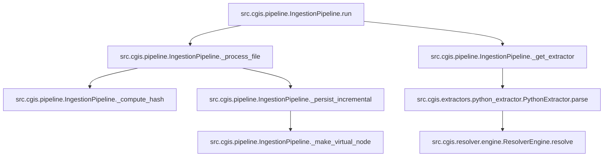

# Self‑Documenting Knowledge Portal

This documentation is **self‑generated** from the CodeGraph Intelligence System (CGIS). The graph of the codebase is automatically injected below.

<!-- START_CGIS_GRAPH -->

<!-- END_CGIS_GRAPH -->
